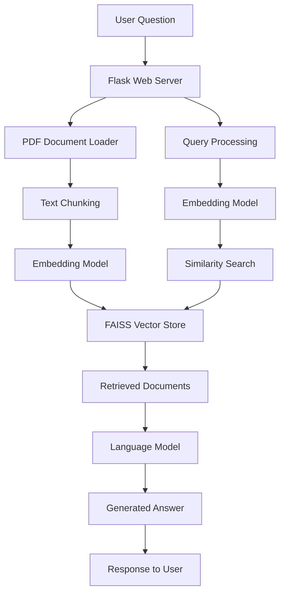
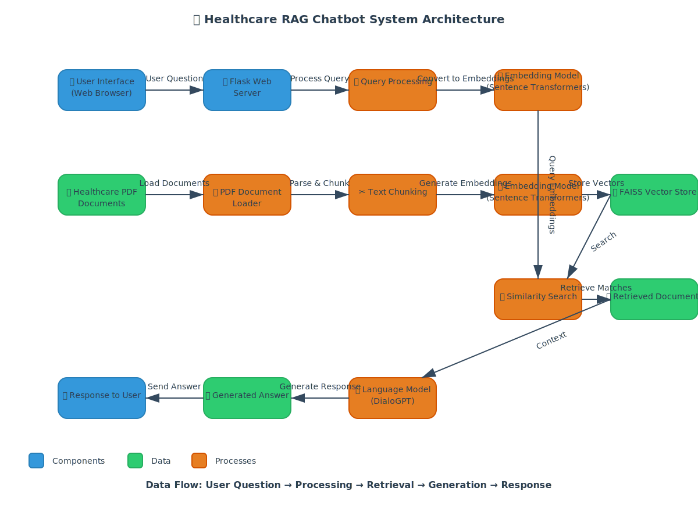

# 🩺 HealthQuery AI - Healthcare RAG Chatbot

<div align="center">
  


### 🚀 Your Intelligent Health Assistance Partner

**Combining Advanced AI with Medical Knowledge**

[✨ Features](#-features) • [🏗️ Architecture](#️-architecture) • [📦 Installation](#-installation) • [🎯 Usage](#-usage) • [🛠️ Tech Stack](#️-tech-stack)

---

</div>

## 📖 Overview

**HealthQuery AI** is a cutting-edge healthcare chatbot powered by **Retrieval-Augmented Generation (RAG)** technology. It seamlessly combines state-of-the-art language models with comprehensive medical knowledge extracted from PDF documents to deliver accurate, context-aware health information.

<div align="center">



</div>

### 🎯 How It Works

Our two-stage intelligent pipeline:

1. **🔍 Retrieval Stage**: Leverages semantic search to identify the most relevant medical information from an extensive healthcare knowledge base
2. **💬 Generation Stage**: Employs advanced conversational AI to craft natural, accurate responses grounded in retrieved medical context

---

## ✨ Features

<div align="center">

| Feature | Description |
|---------|-------------|
| 🏥 **Medical Expertise** | Powered by verified medical literature and research papers |
| 🔒 **Secure & Private** | Your conversations remain completely confidential |
| ⚡ **Instant Responses** | 24/7 access to AI-powered health information |
| 🎯 **RAG Technology** | Advanced retrieval-augmented generation for precision |
| 🎨 **Modern UI** | Beautiful responsive interface with light/dark mode |
| 🧠 **Context-Aware** | Responses generated from relevant medical documents |
| 🚀 **GPU Accelerated** | Automatic CUDA support for lightning-fast processing |

</div>

---

## 🏗️ Architecture

### 📊 System Flow Diagram



### 📈 Detailed Architecture

The HealthQuery AI system consists of several key components working together:

1. **Frontend Interface**: A responsive web interface built with React for interacting with the chatbot
2. **Flask Backend**: A Python Flask server that handles API requests and coordinates the RAG pipeline
3. **Document Processing Pipeline**: 
   - PDF document loader that extracts text from medical documents
   - Text chunking system that breaks documents into manageable pieces
   - Embedding model that converts text to vector representations
4. **Vector Store**: FAISS-based similarity search index for fast document retrieval
5. **Language Model**: DialoGPT for generating natural language responses
6. **API Layer**: RESTful endpoints for communication between frontend and backend

### 🔧 Core Components

<table>
<tr>
<td width="50%">

#### 🎨 Frontend Layer
- React-based modern UI
- Responsive mobile-first design
- Real-time typing animations
- Light/Dark mode toggle

</td>
<td width="50%">

#### ⚙️ Backend Layer
- Flask REST API server
- CORS-enabled endpoints
- Efficient request handling
- Error management system

</td>
</tr>
<tr>
<td width="50%">

#### 🧠 RAG Pipeline
- Intelligent document processing
- Semantic text chunking
- Vector embedding generation
- Similarity-based retrieval

</td>
<td width="50%">

#### 🤖 AI Models
- **Embeddings**: all-MiniLM-L6-v2
- **Generation**: DialoGPT-small
- **Storage**: FAISS IndexFlatL2
- **GPU**: CUDA auto-detection

</td>
</tr>
</table>

---

## 📁 Project Structure

```
RAG Healthcare Bot/
│
├── 🐍 app.py                    # Main Flask application
├── 🏠 index.html                # Landing page
├── 💬 bot.html                  # Chat interface
├── 📄 health.pdf                # Medical knowledge base
├── 📋 requirements.txt          # Python dependencies
├── 📊 architecture.mermaid      # System diagram
│
├── 📂 static/                   # Static assets
│   ├── 🤖 bot.svg              # Bot avatar
│   └── 👤 face.svg             # User avatar
│
├── 🌐 healthrag/                # Virtual environment
│
└── 📖 README.md                 # Documentation
```

---

## 📦 Installation

### ✅ Prerequisites

<div align="center">

| Requirement | Version |
|-------------|---------|
|  | Windows 10 or later |
|  | Python 3.8+ |
|  | Python package manager |

</div>

### 🚀 Quick Setup

#### **Step 1**: Clone the Repository

```bash
git clone <repository-url>
cd "RAG Healthcare Bot"
```

#### **Step 2**: Create Virtual Environment

```bash
python -m venv healthrag
```

#### **Step 3**: Activate Virtual Environment

```bash
# Windows
healthrag\Scripts\activate

# Linux/Mac
source healthrag/bin/activate
```

#### **Step 4**: Install Dependencies

```bash
pip install -r requirements.txt
```

#### **Step 5**: First Run Setup

> 💡 **Note**: The application will automatically download required AI models on first run. This may take 2-5 minutes depending on your internet connection.

---

## 🎯 Usage

### 🏃 Starting the Application

```bash
python app.py
```

<div align="center">

### 🌐 Access the Interface

Open your browser and navigate to:

```
http://localhost:5000
```

</div>

### 💬 Using the Chatbot

1. **🏠 Homepage**: Click **"Start Consultation"** button
2. **💭 Ask Questions**: Type your health-related query
3. **⌨️ Submit**: Press `Enter` or click the send button
4. **📖 Get Answers**: Receive AI-generated responses instantly

---

## 🛠️ Tech Stack

<div align="center">

### 🔧 Backend Technologies


### 🎨 Frontend Technologies


</div>

---

## 🔬 Technical Deep Dive

### 🎯 RAG Pipeline Architecture

#### **1️⃣ Document Processing**

```python
# health.pdf → PyPDF → Text Chunks (500 chars, 50 overlap)
documents = load_pdf("health.pdf")
chunks = split_text(documents, chunk_size=500, overlap=50)
embeddings = embed_model.encode(chunks)
```

#### **2️⃣ Vector Storage**

```python
# FAISS IndexFlatL2 for semantic similarity
index = faiss.IndexFlatL2(dimension=384)
index.add(embeddings)
```

#### **3️⃣ Query Processing**

```python
# Semantic search for top-4 relevant documents
query_embedding = embed_model.encode(user_question)
distances, indices = index.search(query_embedding, k=4)
context_docs = [chunks[i] for i in indices[0]]
```

#### **4️⃣ Response Generation**

```python
# Context-aware response using DialoGPT
prompt = f"Context: {context_docs}\n\nQuestion: {user_question}"
response = language_model.generate(prompt)
```

### ⚡ Key Implementation Features

<table>
<tr>
<td>

**🚀 GPU Acceleration**
- Automatic CUDA detection
- Fallback to CPU if unavailable
- Optimized tensor operations

</td>
<td>

**🛡️ Error Handling**
- Graceful model loading
- API error management
- Fallback mechanisms

</td>
</tr>
<tr>
<td>

**📱 Responsive Design**
- Mobile-first approach
- Dark/Light mode toggle
- Smooth animations

</td>
<td>

**⚙️ Smart Fallbacks**
- Dummy docs if PDF missing
- Default model responses
- Connection error handling

</td>
</tr>
</table>

---

## 🤝 Contributing

<div align="center">

We welcome contributions! 🎉

[](http://makeapullrequest.com)

**Steps to Contribute:**

1. 🍴 Fork the repository
2. 🌿 Create your feature branch (`git checkout -b feature/AmazingFeature`)
3. ✅ Commit your changes (`git commit -m 'Add some AmazingFeature'`)
4. 📤 Push to the branch (`git push origin feature/AmazingFeature`)
5. 🎯 Open a Pull Request

</div>

---

## 📄 License

<div align="center">

This project is licensed under the **MIT License**

[](https://opensource.org/licenses/MIT)

See the [LICENSE](LICENSE) file for details.

</div>

---

## ⚠️ Disclaimer

<div align="center">

This healthcare chatbot is designed for educational and informational purposes only. It is not intended to replace professional medical advice, diagnosis, or treatment. Always seek the advice of your physician or other qualified health provider with any questions you may have regarding a medical condition.

</div>

---

<div align="center">

### 💡 Built with ❤️ using AI and Modern Web Technologies

**[🔝 Back to Top](#-healthquery-ai---healthcare-rag-chatbot)**

</div>
