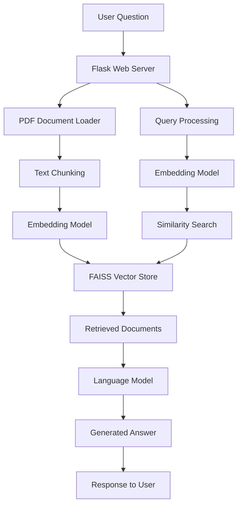

# 🚀 Just Launched: Healthcare RAG Chatbot! 🏥🤖

I'm excited to share my latest project - a **Healthcare RAG Chatbot** that combines cutting-edge AI with practical healthcare applications! 🌟

## 📋 Project Overview
This intelligent chatbot provides accurate healthcare information by retrieving relevant content from medical documents and generating concise, reliable answers. Built with Retrieval-Augmented Generation (RAG) technology to ensure responses are grounded in real medical data. 📚✅

## 🛠️ Tech Stack & Architecture
- **Python** 🐍 - Primary programming language
- **Flask** 🌐 - Web framework for the backend API
- **PyTorch** 🔥 - Machine learning framework for GPU acceleration
- **Transformers (Hugging Face)** 🤗 - Pre-trained language models
- **FAISS** 🗃️ - Vector database for efficient similarity search
- **Sentence Transformers** 🧠 - Text embedding generation

### 🏗️ System Architecture

## 🔍 How It Works
1. **📥 Data Ingestion**: Medical documents are parsed, chunked, and converted to embeddings
2. **🔍 Retrieval**: User questions are matched with relevant document sections using FAISS
3. **🤖 Generation**: Context-aware answers are generated using DialoGPT
4. **📤 Response**: Accurate, concise healthcare information is delivered to users

## 💡 Key Features
- GPU-accelerated processing for faster responses ⚡
- Source-based responses prevent AI hallucination 🚫
- Handles various medical question types 🩺
- Built-in fallback mechanisms for missing documents 🛡️

## 🎯 Potential Applications
- Patient education and information 🧑‍⚕️
- Medical student learning assistant 📖
- Healthcare professional reference tool 🔍
- Telemedicine support system 📱

## 🚀 What I Learned
- Implementing RAG systems from scratch
- Optimizing AI models for limited GPU resources
- Building efficient vector search systems
- Creating production-ready Flask APIs

## 🔮 Future Improvements
- Fine-tuning on medical domain data 🎯
- Multi-language support 🌍
- Voice input/output capabilities 🎤
- Integration with electronic health records 📋

Check out the full codebase and documentation on GitHub! 🌟

#AI #MachineLearning #HealthTech #RAG #Python #Flask #PyTorch #NLP #HealthcareInnovation #OpenSource #DataScience #MedicalAI #Chatbot #VectorSearch #FAISS #HuggingFace

Feel free to connect if you're interested in AI, healthcare technology, or just want to chat about cool projects! 💬✨