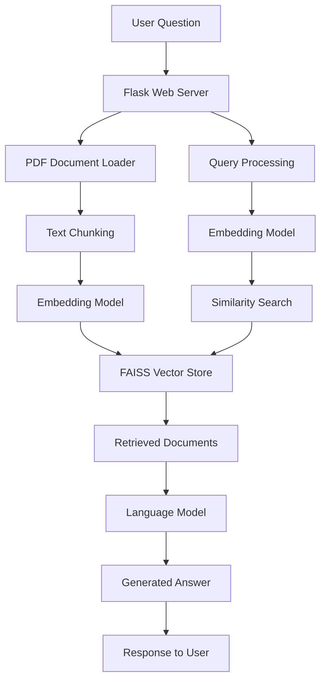
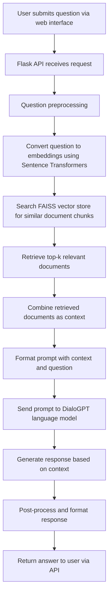

# Healthcare RAG Chatbot - Interview Questionnaire

## 1. What is the Healthcare RAG Chatbot project?

The Healthcare RAG Chatbot is an intelligent question-answering system that provides accurate healthcare information by retrieving relevant content from medical documents and generating concise answers. It uses Retrieval-Augmented Generation (RAG) technology to ensure responses are based on actual medical data rather than hallucinated information.

## 2. What technologies and frameworks are used in this project?

### Core Technologies:
- **Python** - Primary programming language
- **Flask** - Web framework for the backend API
- **PyTorch** - Machine learning framework for GPU acceleration
- **Transformers (Hugging Face)** - Pre-trained language models
- **FAISS** - Vector database for efficient similarity search
- **Sentence Transformers** - Text embedding generation

### Key Components:
- **Frontend**: HTML/CSS/JavaScript with React and Tailwind CSS
- **Backend**: Flask REST API
- **AI Models**: 
  - DialoGPT (conversational AI)
  - all-MiniLM-L6-v2 (text embeddings)
- **Data Processing**: PDF parsing and text chunking

## 3. Can you explain the architecture of the Healthcare RAG Chatbot?

The architecture consists of three main phases:

1. **Data Ingestion Phase**:
   - Medical documents (PDFs) are loaded and parsed
   - Text is split into manageable chunks
   - Each chunk is converted to embeddings using Sentence Transformers
   - Embeddings are stored in FAISS vector database

2. **Retrieval Phase**:
   - User questions are converted to embeddings
   - Similarity search finds relevant document chunks
   - Top-k most relevant documents are retrieved

3. **Generation Phase**:
   - Retrieved documents form the context
   - Language model generates answer based on context
   - Response is formatted and sent to user

## 4. How does the RAG (Retrieval-Augmented Generation) work in this project?

RAG combines two key components:

1. **Retrieval**: When a user asks a question, the system:
   - Converts the question to vector embeddings
   - Searches the FAISS database for similar document chunks
   - Retrieves the most relevant information

2. **Generation**: Using the retrieved context:
   - The language model (DialoGPT) generates a response
   - The response is grounded in actual document content
   - This prevents hallucination and ensures accuracy

This approach ensures answers are both accurate (from real documents) and conversational (natural language generation).

## 5. Why did you choose FAISS for vector storage?

FAISS (Facebook AI Similarity Search) was chosen because:

- **Speed**: Extremely fast similarity search even with large datasets
- **Efficiency**: Optimized for both CPU and GPU operations
- **Scalability**: Handles millions of vectors efficiently
- **Open Source**: Free and well-maintained by Meta
- **Integration**: Works seamlessly with PyTorch and Python

FAISS provides sub-second retrieval times, which is crucial for a responsive chatbot experience.

## 6. How does the system handle GPU acceleration?

The system leverages GPU acceleration through:

1. **PyTorch CUDA Support**:
   - Automatic detection of available GPUs
   - Tensor operations moved to GPU memory
   - Parallel processing of neural network computations

2. **Model Optimization**:
   - Lightweight models (DialoGPT-small) to fit 4GB VRAM
   - Efficient memory management
   - Batch processing where possible

3. **Embedding Generation**:
   - Sentence transformers utilize GPU for faster encoding
   - Parallel processing of multiple embeddings

This results in significantly faster inference times compared to CPU-only processing.

## 7. What happens if the healthcare PDF document is not available?

The system has built-in fallback mechanisms:

1. **Dummy Document Initialization**:
   - If health.pdf is missing, the system creates placeholder documents
   - These contain basic healthcare information templates
   - System continues to function with limited knowledge

2. **Error Handling**:
   - Graceful error messages inform users about missing documents
   - Clear instructions for adding proper medical documents
   - Logging for system administrators

3. **Extensibility**:
   - Easy to add new documents without system restart
   - Support for multiple document formats

## 8. How do you ensure the accuracy of medical information?

Several measures ensure information accuracy:

1. **Source-Based Responses**:
   - Answers are generated only from provided medical documents
   - No external information is used or hallucinated

2. **Document Grounding**:
   - Every response is tied to specific document sections
   - Context is explicitly shown in the prompt to the language model

3. **Quality Control**:
   - Careful selection of authoritative medical documents
   - Regular updates to document corpus
   - Validation of document sources

4. **Limitations Awareness**:
   - System clearly states when it doesn't know an answer
   - Encourages consultation with healthcare professionals
   - Disclaimers about educational use only

## 9. What are the main challenges you faced during development?

Key challenges included:

1. **GPU Memory Limitations**:
   - 4GB VRAM constraint required lightweight models
   - Balancing model capability with memory requirements
   - Solution: Using DialoGPT-small instead of larger models

2. **Model Selection**:
   - Finding models that work well on limited hardware
   - Ensuring medical domain relevance
   - Balancing speed and accuracy

3. **Document Processing**:
   - Handling various PDF formats and structures
   - Efficient text chunking for optimal retrieval
   - Managing document quality and completeness

4. **Response Quality**:
   - Ensuring answers are concise and accurate
   - Preventing hallucination in generated responses
   - Maintaining conversational flow

## 10. How can this system be extended or improved?

Potential improvements include:

1. **Model Enhancements**:
   - Fine-tuning on medical domain data
   - Implementing more advanced RAG techniques
   - Adding multi-document reasoning

2. **System Scalability**:
   - Supporting multiple concurrent users
   - Implementing document versioning
   - Adding user authentication

3. **Feature Extensions**:
   - Multi-language support
   - Voice input/output capabilities
   - Integration with electronic health records
   - Personalized health recommendations

4. **Performance Improvements**:
   - Caching frequent queries
   - Asynchronous processing
   - Model quantization for better GPU utilization

## 11. What security considerations were taken into account?

Security measures include:

1. **Data Privacy**:
   - No personal health information is stored
   - All processing happens locally
   - No external API calls with sensitive data

2. **Input Validation**:
   - Sanitization of user inputs
   - Prevention of injection attacks
   - Rate limiting to prevent abuse

3. **System Isolation**:
   - Containerized deployment options
   - Limited file system access
   - Secure API endpoints

## 12. How does the system handle different types of medical questions?

The system is designed to handle various question types:

1. **Factual Questions**:
   - "What are the symptoms of diabetes?"
   - Direct retrieval of relevant document sections

2. **Procedural Questions**:
   - "How to perform CPR?"
   - Step-by-step information extraction

3. **Comparative Questions**:
   - "What's the difference between flu and cold?"
   - Retrieval of multiple relevant document sections

4. **Preventive Care**:
   - "How to maintain heart health?"
   - Holistic information gathering

The RAG approach ensures that regardless of question type, responses are grounded in actual medical documentation.

## 13. Can you explain the user flow what is happening in the backend?

The user flow in the backend follows these steps:

1. **User Interaction**: User types a healthcare question in the web interface and clicks submit
2. **API Request**: The frontend sends the question to the Flask backend via a POST request to `/api/chat`
3. **Question Processing**: Backend validates and preprocesses the question
4. **Embedding Generation**: The question is converted to vector embeddings using the Sentence Transformers model
5. **Similarity Search**: FAISS performs a similarity search to find the most relevant document chunks
6. **Document Retrieval**: Top 4 most relevant documents are retrieved from the vector store
7. **Context Formation**: Retrieved documents are combined to form the context for the language model
8. **Prompt Construction**: A prompt is created combining the context and the original question
9. **Response Generation**: The DialoGPT model generates an answer based on the prompt
10. **Response Formatting**: The answer is formatted and any post-processing is applied
11. **User Response**: The final answer is sent back to the user through the web interface

This entire process typically takes 1-3 seconds depending on GPU availability and question complexity.

## 14. Explain the query processing, text chunking, similarity search, FAISS vector store, embedding model, and retrieved document - what role they play in my project?

### Query Processing
**Role**: Prepares user questions for the retrieval system
**Function**: 
- Receives natural language questions from users
- Cleanses and normalizes the text
- Converts questions into a format suitable for embedding generation
- Manages error handling for invalid inputs

### Text Chunking
**Role**: Breaks large documents into manageable pieces
**Function**:
- Splits medical documents into 500-character chunks with 50-character overlap
- Ensures each chunk contains coherent information
- Balances chunk size for retrieval accuracy vs. processing efficiency
- Creates multiple overlapping chunks to preserve context continuity

### Embedding Model (Sentence Transformers)
**Role**: Converts text into numerical vectors
**Function**:
- Transforms both document chunks and user queries into high-dimensional vectors
- Uses the all-MiniLM-L6-v2 model for efficient encoding
- Generates semantically meaningful embeddings where similar texts have similar vectors
- Runs on GPU for faster processing when available

### FAISS Vector Store
**Role**: Stores and searches document embeddings efficiently
**Function**:
- Maintains a database of all document chunk embeddings
- Performs fast similarity searches using L2 distance metric
- Retrieves the top-k most similar document chunks to a query
- Optimized for both CPU and GPU operations

### Similarity Search
**Role**: Finds relevant documents based on semantic similarity
**Function**:
- Compares query embedding with all stored document embeddings
- Calculates distances between vectors to determine relevance
- Returns indices of the most similar document chunks
- Enables sub-second retrieval from large document collections

### Retrieved Documents
**Role**: Provide context for answer generation
**Function**:
- Supply relevant medical information to the language model
- Form the knowledge base from which answers are generated
- Ensure responses are grounded in actual document content
- Prevent hallucination by limiting responses to known information

Together, these components form the retrieval pipeline that ensures the chatbot can quickly find and use relevant medical information to answer user questions accurately.